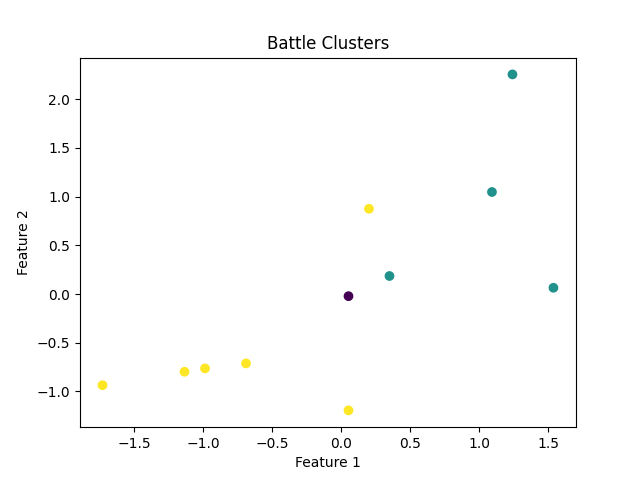

# Supervised Learning for Napoleonic Strategy

This project applies supervised learning techniques to predict the outcomes of Napoleonic battles based on historical data.

## Project Structure



## Installation

1. **Clone the repository:**
    ```sh
    git clone https://github.com/yourusername/supervised-learning.git
    cd supervised-learning
    ```

2. **Install dependencies using Poetry:**
    ```sh
    poetry install
    ```

## Usage

1. **Run the prediction script:**
    ```sh
    poetry run python src/battle_predict.py
    ```

2. **Output:**
    The script will print the accuracy and classification report of the model.

## Data

The dataset [battles.csv](http://_vscodecontentref_/7) contains historical data of Napoleonic battles with the following columns:
- Battle Name
- Date
- Commander
- Troop Strength
- Opponent Commander
- Opponent Strength
- Terrain
- Weather
- Strategy Used
- Outcome

## Model

The model uses a Random Forest Classifier to predict the outcome of battles. The features used for prediction include:
- Troop Strength
- Opponent Strength
- Terrain
- Weather
- Troop Ratio (derived feature)

## License

This project is licensed under the MIT License. See the [LICENSE](http://_vscodecontentref_/8) file for details.

## Author

Gareth Murphy - [16783958+garethcmurphy@users.noreply.github.com](https://github.com/garethcmurphy)

## Contributing

Contributions are welcome! Please open an issue or submit a pull request.

## Acknowledgements

- [Pandas](https://pandas.pydata.org/)
- [Scikit-learn](https://scikit-learn.org/)


